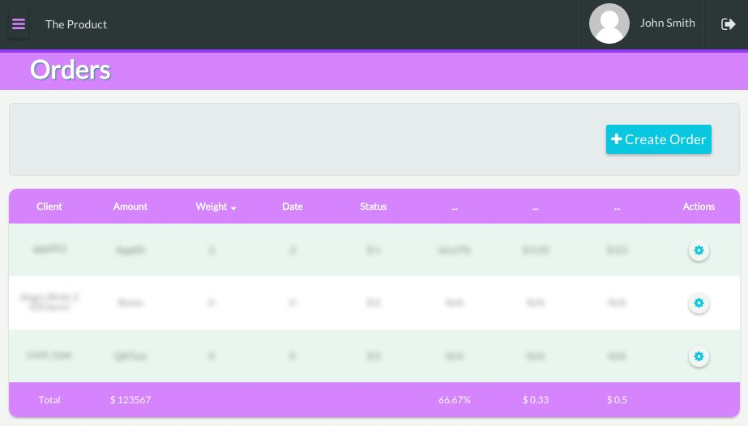

# Front End Developer Test Case

Build an application with (preferably with AngularJS) or any other framework you desire. 
You can use the following API as backend: 
[https://angular­api­demo.herokuapp.com/documentation​](https://angular­api­demo.herokuapp.com/documentation​)
or simply mock the backend part. 
 
The application is an Order Management System: 
 
* An order should have basic CRUD capabilities (user should be able to create, edit and 
delete an order).  
* Every order should have an id, name, weight, destination, creation date, client_id 
(should be selected from a list of clients which is returned from a fake mock API 
endpoint). 
* The user should be able to view all orders and sort them by fields. 
* The application should have a sticky header with the logged in user name. 
* The user should be able to edit his information (email, name, etc.) 
 
The design should look similar to the attached:

